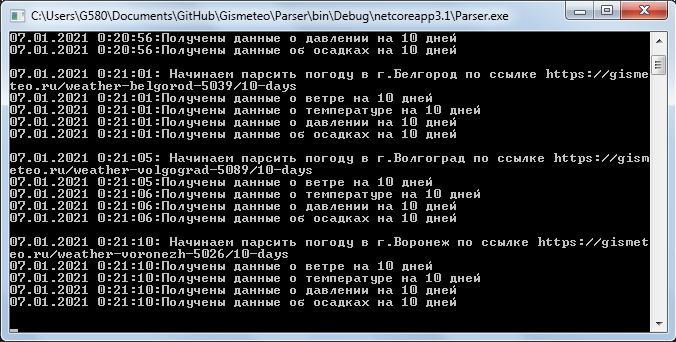
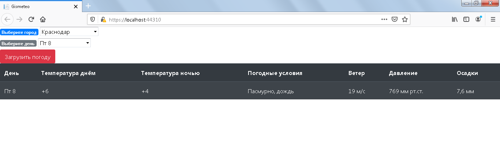
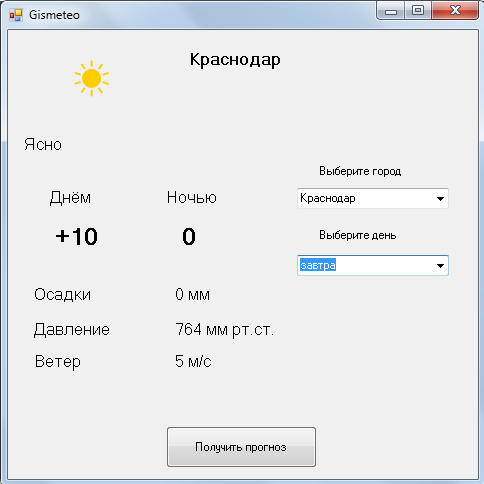

<h3 align="center">
  Gismeteo
</h3>
Состоит из 3 компонентов:

**Parser**
---
Консольное приложение для парсинга и сохранения в Бд (MongoDb) данных о погоде за 10 дней
в популярных городах России. 
> При помощи HtmlAgilityPack вырезаем из html нужные нам данные
> и сохраняем в Бд.

**WEB API**
---
Web Api MVC имеет открытый метод, позволяющий делать запрос в БД и 
представление-клиент для обращения к этому методу и выводу bootstrap таблицы
с погодой из БД.

**WinForms Client**
---
Клиент WinForm для обращения к открытому методу Web Api и выводу полученной
информации.
> Есть возможность выбора города и дня.
